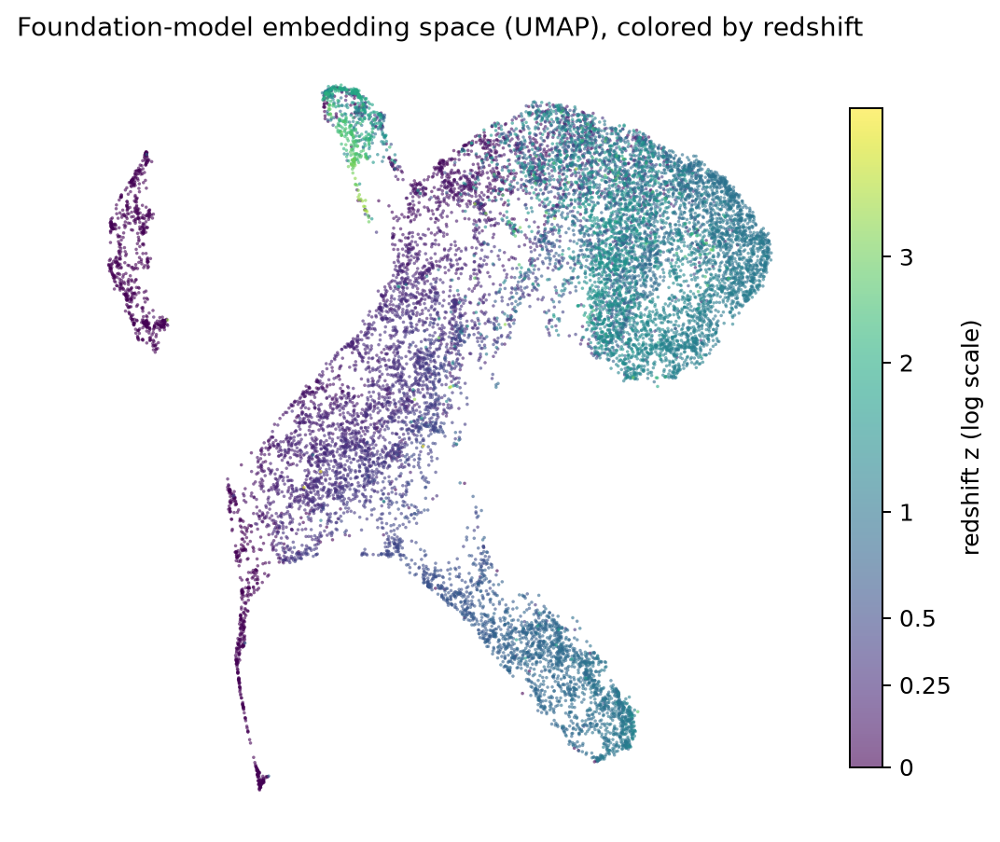

# spectra-copilot

LLM agent that analyzes astronomical spectra using the
[desi-fm](https://github.com/Julian0444/desi-spectra-fm) foundation model as a
tool — deterministic tools plus a Claude-API agent that calls the model,
*physically verifies* its prediction against known spectral lines, and writes
an observation report where every claim cites the tool that backs it. Every
tool returns compact JSON conclusions, never raw arrays.

**Tools** (`copilot/tools.py`):

- `predict_redshift` — desi-fm v2.1 prediction: `z_pred_map` (official) +
  `z_confidence` + `z_pred` (secondary regression head).
- `identify_spectral_lines` — detects emission peaks and checks whether known
  lines (Lyα … [SII]) land where a given z predicts; it also reports the
  strongest detected peaks, so the agent can derive alternative z hypotheses
  from an unexplained peak. This lets the agent *physically verify* the model
  instead of just repeating it.
- `reconstruct_spectrum` — masks a fraction of the model's tokens and
  re-predicts, probing the stability of the prediction.
- `find_similar_spectra` — embeds the spectrum with the model's encoder and
  retrieves its nearest neighbors from a FAISS index of 15k DESI training
  spectra, each with its catalog redshift — a second, line-independent
  validation signal ([details below](#semantic-search-embeddings--faiss)).

## Quick start

```bash
pip install -e ".[dev]"
# optional: skip the ~104 MB Hub download by pointing at a local checkpoint
export DESI_FM_CKPT=/path/to/desi-spectra-fm/runs/desi_80k_classhead_v21/checkpoint_last.pt
pytest -q                                  # 20 passed
python -m copilot examples/heldout_z020.npz
```

Without `DESI_FM_CKPT`, the public checkpoint is downloaded from
[jirustaroure/desi-spectra-fm](https://huggingface.co/jirustaroure/desi-spectra-fm)
and cached. The `examples/` spectra are real DESI held-out objects (never seen
in training), each with its `z_true` for reference —
`examples/trap_single_line.npz` is the synthetic exception, see below.

Example output (`examples/heldout_z020.npz`, real galaxy at z_true = 0.204):

```json
{
  "input": "examples/heldout_z020.npz",
  "predict_redshift": {
    "z_pred_map": 0.2267,
    "z_confidence": 0.6376,
    "z_pred": 0.2314
  },
  "identify_spectral_lines": {
    "z_tested": 0.2267,
    "n_peaks_detected": 64,
    "strongest_peaks_angstrom": [7900.8, 4488.0, 3644.0, 3740.0, 5852.0],
    "n_expected_in_coverage": 11,
    "n_matched": 2,
    "match_fraction": 0.18,
    "matched_lines": [
      {"line": "Hβ 4861", "lambda_expected": 5963.4, "matched_peak_at": 5968.8, "delta": 5.4},
      {"line": "[NII] 6583", "lambda_expected": 8076.0, "matched_peak_at": 8085.6, "delta": 9.6}
    ],
    "verdict": "weak_or_inconsistent"
  },
  "z_true_reference": 0.2036
}
```

Note what the line tool buys the agent: at the model's `z_pred_map = 0.2267`
only 2/11 lines match, but at the true `z = 0.2036` the same spectrum matches
**8/11 (`consistent`)** — and the strongest peak (7900.8 Å) read as Hα gives
exactly that z. The tool can catch and refine an off prediction, and a wrong z
(e.g. 0.85) stays weak. That contrast is what the agent exploits.

## The agent (Claude API)

`copilot/agent.py` drives Claude through the SDK tool runner: predict →
verify against lines → if `z_confidence < 0.3` or the match is weak, derive
alternative hypotheses from the strongest peaks and compare their
match_fractions before concluding; `find_similar_spectra` adds a
line-independent neighbor check on the candidate z. (The reference transcripts
below predate the similarity tool — it joined the toolset with the semantic
search.)

```bash
export ANTHROPIC_API_KEY=sk-ant-...
python -m copilot.agent examples/heldout_z020.npz
python -m copilot.agent examples/trap_single_line.npz \
    --model claude-haiku-4-5 --save-transcript eval/transcripts/trap.json
```

Measured cost per analysis (token usage is printed to stderr after each run):
**`claude-opus-4-8`** (default) ≈ **$0.09–0.13**; **`claude-haiku-4-5`** ≈
**$0.013** — cheap enough to iterate with, and it completes the full
verify-then-refine loop too. Full transcripts of the four reference runs
(including every tool call and result) are in
[`eval/transcripts/`](eval/transcripts/).

### Example report — the agent beats its own model

On `heldout_z020.npz` the model alone is off by Δz ≈ 0.023 (a catastrophic
outlier at |Δz|/(1+z) > 0.015). The agent catches it and recovers the true
redshift (report verbatim, `claude-opus-4-8`):

> ## Observation report
>
> **Object**
> Emission-line galaxy with a rich star-forming spectrum: [OII], full Balmer
> series (Hα, Hβ, Hγ), [OIII] doublet, [NII], and [SII] all detected
> (identify_spectral_lines at z = 0.2038).
>
> **Redshift**
> z ≈ 0.204. The model's official prediction z_pred_map = 0.2267
> (z_confidence = 0.64, z_pred = 0.2314) is rejected: it matched only 2/11
> lines (match_fraction = 0.18, predict_redshift + identify_spectral_lines).
> Reassigning the strongest peak (7900.8 Å) to Hα 6563 gives z = 0.204, which
> matches 8/11 lines (match_fraction = 0.73) with sub-Ångström residuals
> (Hβ Δ0.0, [OIII] 5007 Δ0.0, Hα Δ0.5; identify_spectral_lines).
>
> **Evidence**
> z = 0.204 strongly favored: 8/11 lines matched (0.73) vs 2/11 (0.18) at
> z_pred_map = 0.2267, 4/9 (0.44) at z = 0.578, and 2/7 (0.29) at z = 1.12
> (identify_spectral_lines). Only z = 0.204 reproduces the coherent
> Hα+[NII]+[SII] complex and the [OIII] doublet simultaneously, and its
> matches have the smallest deltas (all ≤1.3 Å vs 3–12 Å for the z = 0.578
> alternative).
>
> **Confidence**
> High on physical grounds. The line solution at z = 0.204 is internally
> consistent and unambiguous relative to all competitors, even though the
> foundation model itself misplaced the redshift.
>
> **Notes**
> This is a catastrophic-outlier case where z_confidence (0.64) was
> misleadingly high — a reminder that verification, not confidence, is
> decisive. The model's z_pred_map (0.2267) is offset by ~0.023 from the true
> peak identification, likely fitting Hβ/[NII] to the wrong lines.
> Recommended adopted value: z = 0.204.

The catalog value is z_true = 0.2036.

### The trap — refusing to invent certainty

`examples/trap_single_line.npz` (generated by
`scripts/make_trap_example.py`) has a **single** emission line at 8000 Å on a
noiseless continuum: it could be Hα at z = 0.219, [OIII] 5007 at z = 0.598 or
[OII] 3727 at z = 1.146, and nothing breaks the tie. The right answer is to
say so — and the agent does (report verbatim, `claude-opus-4-8`):

> ## Observation report
>
> **Object**
> Single-line emission source; only one peak detected across coverage at
> 7999.6 Å (identify_spectral_lines). Likely an emission-line galaxy/QSO, but
> type unconstrained.
>
> **Redshift**
> Indeterminate — this is a single-line trap. The model's official
> z_pred_map = 2.7922 (z_confidence = 0.1894, regression z_pred = 2.0089;
> predict_redshift). That low confidence flags a likely catastrophic outlier,
> and it is refuted: 0/3 expected lines matched at z = 2.7922, 0/4 at
> z = 2.0089 (identify_spectral_lines).
>
> The lone peak at 7999.6 Å can be assigned to any strong line, each giving a
> self-consistent but unverifiable single-line solution:
> - Hα 6563 → z = 0.2188: 1/11 matched (Δ=0.9 Å)
> - [OIII] 5007 → z = 0.5977: 1/9 matched (Δ=0.3 Å)
> - [OII] 3727 → z = 1.1464: 1/7 matched (Δ=0.2 Å)
> (all identify_spectral_lines)
>
> **Evidence**
> No second confirming line exists at any hypothesis — no [OII]/Hβ/[OIII]
> doublet partners, no Hα+[NII], no Lyα/CIV/MgII companions. Every candidate
> matches exactly one line (its own assumed identity) and nothing else, so
> match_fraction is dominated by how many lines each z predicts in-band, not
> by real corroboration.
>
> **Confidence**
> Very low. No redshift is defensible. The model prediction (z≈2.79) is
> rejected (0 matched lines); the three physical single-line solutions are
> mutually indistinguishable on current evidence (each 1 matched line, sub-Å
> residuals).
>
> **Notes**
> A redshift cannot be responsibly reported from one line. Resolving this
> requires either (a) checking whether 7999.6 Å shows a resolved doublet
> (favoring [OII] 3727) or asymmetry (favoring Lyα), or (b) deeper data to
> detect a second line. Until then, z is ambiguous among {0.219, 0.598,
> 1.146}, with the model's own z≈2.79 disfavored.

The other two reference runs: on `heldout_z287.npz` (QSO, z_true = 2.866) the
model predicts 2.441 but the agent re-anchors the strongest peak as Lyα and
reports z ≈ 2.874 with the competing hypothesis stated; on
`heldout_lowconf_z157.npz` the agent correctly discards the model's
low-confidence outlier (z_confidence = 0.18), though its peak-based recovery
lands on z ≈ 1.98 vs the catalog 1.574 — the strong UV lines at that z fall
outside DESI coverage, an honest limitation of emission-peak verification.

## Semantic search (embeddings + FAISS)

The foundation-model encoder doubles as an **embedding model**: `desi_fm`'s
`embed_spectrum()` mean-pools the valid spectral tokens into a 512-d vector,
and `scripts/build_index.py` indexes 15k DESI training spectra
(L2-normalized → `faiss.IndexFlatIP`, i.e. cosine similarity). The index ships
on the [Hub](https://huggingface.co/jirustaroure/desi-spectra-fm/tree/main/faiss)
and is downloaded automatically on first use (~30 MB); the held-out `examples/`
are *not* in it by construction (it indexes the training side of the split).

A real query — the held-out galaxy at z_true = 0.204 whose official model
prediction was off (z_pred_map = 0.2267):

```json
{
  "k": 5, "index_size": 15000,
  "neighbors": [
    {"rank": 1, "similarity": 0.992, "z": 0.187},
    {"rank": 2, "similarity": 0.992, "z": 0.202},
    {"rank": 3, "similarity": 0.991, "z": 0.198},
    {"rank": 4, "similarity": 0.990, "z": 0.192},
    {"rank": 5, "similarity": 0.989, "z": 0.193}
  ],
  "neighbor_z_range": [0.187, 0.202], "neighbor_z_median": 0.193
}
```

The five nearest neighbors cluster tightly around the true redshift — evidence
from the embedding space, independent of the classification head, that backs
the line-verified z ≈ 0.204 over the model's own 0.2267. The tool is equally
honest about failure modes: on the low-confidence outlier
(`heldout_lowconf_z157.npz`) the neighbor redshifts scatter across
[0.13, 1.39] — the embedding is not distinctive, doubt confirmed — and the
synthetic single-line trap peaks at similarity 0.90 vs ~0.99 for real DESI
spectra: far from the data manifold, neighbors not to be trusted.

The same embeddings, projected with UMAP and colored by catalog redshift:



Nobody told the model to order spectra by redshift — the smooth z gradient is
structure it learned from masked-spectrum pretraining alone. That is the
foundation-model claim in one picture: representations reusable downstream,
not just a z head. (Reproduce with `scripts/build_index.py` +
`scripts/plot_umap.py`.)

## Use it from any MCP client

`copilot/mcp_server.py` exposes the same four tools over the
[Model Context Protocol](https://modelcontextprotocol.io) (stdio transport),
so any MCP client — Claude Code, Claude Desktop, the `mcp dev` inspector —
can drive the foundation model directly. The client's LLM does the reasoning;
the tools only report measurements.

Register it in **Claude Code** (use the venv python so all deps resolve;
`DESI_FM_CKPT` is optional — without it the checkpoint is pulled from the Hub
on the first model call):

```bash
claude mcp add desi-fm \
    -e DESI_FM_CKPT=/path/to/checkpoint_last.pt \
    -- /path/to/spectra-copilot/.venv/bin/python \
       /path/to/spectra-copilot/copilot/mcp_server.py
claude mcp list   # desi-fm: ... - ✔ Connected
```

Or in **Claude Desktop**
(`~/Library/Application Support/Claude/claude_desktop_config.json`):

```json
{
  "mcpServers": {
    "desi-fm": {
      "command": "/path/to/spectra-copilot/.venv/bin/python",
      "args": ["/path/to/spectra-copilot/copilot/mcp_server.py"],
      "env": {"DESI_FM_CKPT": "/path/to/checkpoint_last.pt"}
    }
  }
}
```

Verified session (Claude Code driving the server on
`examples/heldout_z020.npz`, z_true = 0.204 — no agent code involved, just
the MCP tools and the client's own reasoning):

1. `predict_redshift` → `z_pred_map = 0.2267`, `z_confidence = 0.64`.
2. `identify_spectral_lines(z=0.2267)` → **weak** (2/11 lines,
   match_fraction 0.18): the physics does not confirm the model.
3. `reconstruct_spectrum(mask_ratio=0.5)` → `z_pred_under_masking = 0.2031`,
   a notable swing — fragile evidence.
4. The client reads the strongest peak (7900.8 Å) as Hα and re-tests
   `z = 0.204` → **consistent** (8/11 lines, match_fraction 0.73, deltas
   < 2 Å).

Same detect-and-refine story as the agent's, reproduced by an off-the-shelf
MCP client: the tool descriptions alone are enough to steer the loop.
(`find_similar_spectra` was added after that session; called through the same
MCP layer on the same spectrum it returns the neighbor cluster shown in the
semantic-search section — z ∈ [0.187, 0.202] around the true 0.204.)

## Related

- Model: [desi-spectra-fm](https://github.com/Julian0444/desi-spectra-fm)
  (code) · [HF checkpoint](https://huggingface.co/jirustaroure/desi-spectra-fm)
  · [live demo](https://huggingface.co/spaces/jirustaroure/desi-spectra-fm-demo)
  · [REST API](https://jirustaroure-desi-fm-api.hf.space/api/docs)
